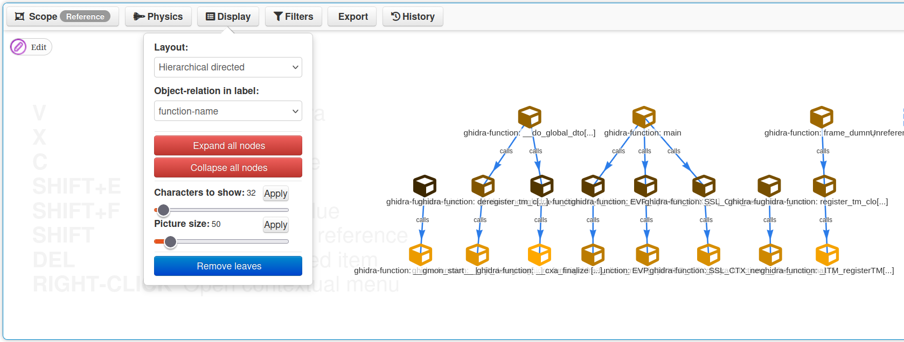

This is a work in progress.

MISP-Ghidra is a python library and scripts to extend Ghidra for exporting ghidra decompilation indicators (functions names, FID hashes, BSIM vectors) to MISP Objects

# Installation

install requirements with your pyghidra venv
```bash
~/.config/ghidra/ghidra_12.0.2_PUBLIC/venv/bin/pip install -r requirements.txt
```

Copy the MISP config.toml template and edit with your own API keys
```bash
cp mispghidra/misp/config/config.template.toml mispghidra/misp/config/config.toml
```

# GUI Usage

Launch ghidra with PyGhidra : `pyghidra -g`

Add the `ghidra_scripts` directory from this git repository to the Ghidra Bundle Manager

The scripts are under the category `MISP`

Run `test-MISP-API.py` to test the connection to the MISP instances API (configured in config.toml)

# Headless Usage

Check the [`/test/`](/test/) directory bash scripts for more examples.

## Add object to existing event in MISP
```bash
pyghidraRun --headless ${PROJECT_PATH} ${PROJECT_NAME} \
    -import ${BINARY_PATH} \
    -postScript ghidra_scripts/ghidra-functions-to-MISP.py \
    --event-uuid ${EVENT_UUID_EXISTING} \
    --function-address ${FUNCTION_ADDRESS}
```
## Add object to new event in MISP
```bash
pyghidra \
pyghidraRun --headless ${PROJECT_PATH} ${PROJECT_NAME} \
    -import ${BINARY_PATH} \
    -postScript ghidra_scripts/ghidra-functions-to-MISP.py \
    --new-event \
    --function-address ${FUNCTION_ADDRESS}
```

## Add all functions as objects to an event
```bash
pyghidraRun --headless ${PROJECT_PATH} ${PROJECT_NAME} \
    -import ${BINARY_PATH} \
    -postScript ghidra_scripts/ghidra-functions-to-MISP.py \
    --new-event \
    --all-functions
```
    
# In MISP

misp-ghidra creates by default the objects: 
```
	file   | file
    ghidra | ghidra-function
```

## Correlation graph on FID hashes

Event correlation graph


## Function call tree graph

Event graph


