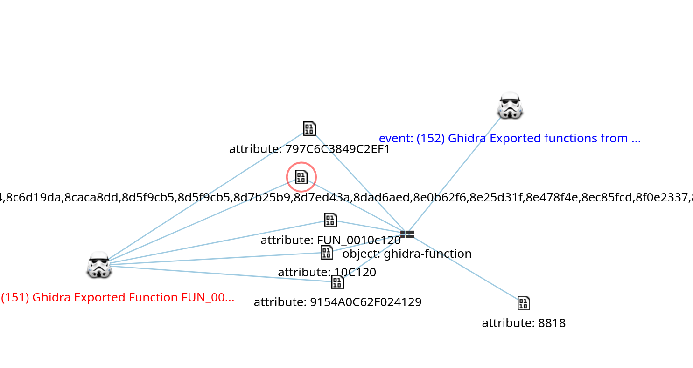

This is a work in progress.

MISP-Ghidra is a python library and scripts to extend Ghidra for exporting ghidra decompilation indicators (functions names, FID hashes, BSIM vectors) to MISP Objects

# Installation

install requirements with your pyghidra venv
```bash
~/.config/ghidra/ghidra_12.0.2_PUBLIC/venv/bin/pip install -r requirements.txt
```

Copy the MISP config.toml template and edit with your own API keys
```bash
cp mispghidra/misp/config/config.template.toml mispghidra/misp/config/config.toml
```

# GUI Usage

Launch ghidra with PyGhidra `ghidra_12.0.2_PUBLIC/support/pyghidraRun`

Add the `ghidra_scripts` directory to the Ghidra Bundle Manager

The scripts are under the category `MISP`

Run `test-MISP-API.py` to test the connection to the MISP instances API (configured in config.toml)

# Headless Usage
## Add object to existing event in MISP
```bash
pyghidra \
    --project-name ${PROJECT_NAME} \
    --project-path ${PROJECT_PATH} \
    ${BINARY_PATH} \
    ghidra_scripts/ghidra-function-to-MISP.py \
    --event-uuid ${EVENT_UUID_EXISTING} \
    --function-address ${FUNCTION_ADDRESS} \
    --verbose
```
## Add object to new event in MISP
```bash
pyghidra \
    --project-name ${PROJECT_NAME} \
    --project-path ${PROJECT_PATH} \
    ${BINARY_PATH} \
    ghidra_scripts/ghidra-function-to-MISP.py \
    --event-uuid "new" \
    --function-address ${FUNCTION_ADDRESS} \
    --verbose
```
# Example MISP usage

For a malware analysis, an event could contain objects : 

	file | file
	file | elf / pe
	file | elf-section / pe-section / pe-optional-header
    file | malware
	ghidra | ghidra-program-metadata
    ghidra | ghidra-function

# MISP Correlation graph


